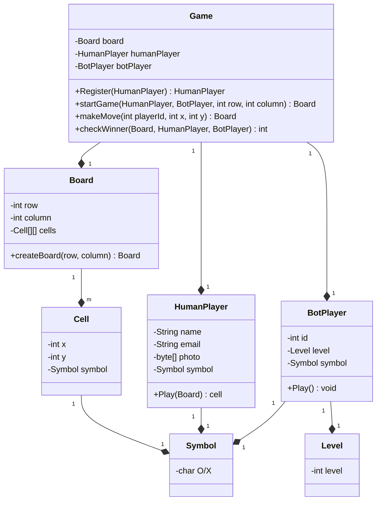

# Design Tic-Tac-Toe

## What is Tic-Tac-Toe?

TicTacToe is a 2 player game played on a 3 x 3 board. Each player is allotted a symbol (one X and one O). Initially, the board is empty. Alternatively, each player takes a turn and puts their symbol at any empty slot. The first player to get their symbol over a complete row OR a complete column OR a diagonal wins.

You can play the game within Google Search by just searching for “tictactoe”!


## Overview
## Clarifications 
## Overview
## Entities
1. Game
2. Board - N X M
3. Cell
4. Player - 2 Players 
   1. Human Player 
   2. Bot Player
      1. DifficultyLevel
5. Symbol - O, X
## Class Diagram
## Implementation
* Create a CLI or API

## Requirements
* Current Scope
  * Size of the board
  * 2 Player or many?
* Future Scope
  * Can there be multiple ways to win the game
* Behavior
  * Can a player play with a Bot?
  * How does a player win?
  * Who starts the game?

## Design
### Use case Diagram
```puml
@startuml
left to right direction
actor HumanPlayer
actor BotPlayer
rectangle game{
  HumanPlayer -- (Register)
  HumanPlayer -- (Start Game)
  HumanPlayer -- (Make Move)
  BotPlayer -- (Make Move)
  (Make Move) >. (Check Winner) : include
}
@enduml
```



## Common Contract - Player Abstract class
- Common Behaviour - `play()`
- common Attribute - `symbol`

## Tight coupling
- HumanPlayer
- BotPlayer
- Player[] players

## OCP and SRP violation in play method

## Huge memory consumption
